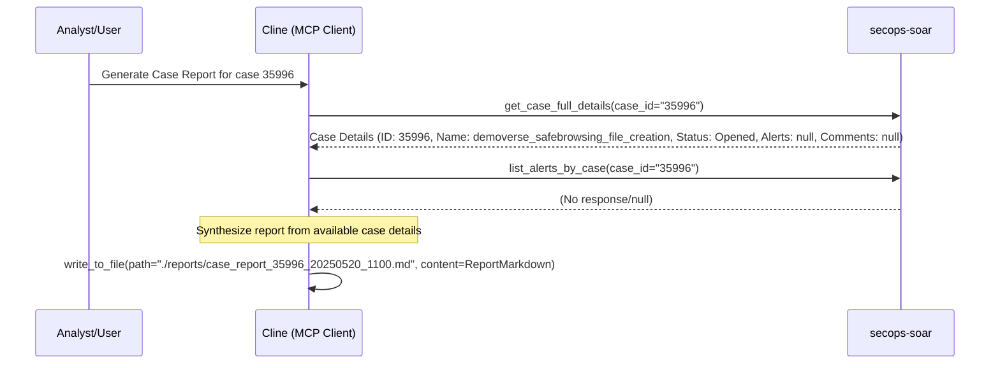

# Case Investigation Report: 35996

**Runbook Used:** Generate Case Investigation Report (.clinerules/run_books/case_report.md)
**Timestamp:** 2025-05-20 11:00 AM Australia/Melbourne
**Case ID(s):** 35996

## Workflow Diagram

## Executive Summary

This report summarizes the initial investigation steps for SOAR case 35996, titled "demoverse_safebrowsing_file_creation". The case is currently "Opened", in "Triage" stage, with "PriorityMedium", and assigned to "@Tier1". The investigation was initiated based on the "Generate Case Investigation Report" runbook. Due to limitations in retrieving alert and comment details, this report is based on the primary case information.

## Case Details

*   **Case ID:** 35996
*   **Display Name:** demoverse_safebrowsing_file_creation
*   **Create Time:** 1747641209151 (Approximately 2025-05-16 10:33:29 UTC)
*   **Update Time:** 1747641253070 (Approximately 2025-05-16 10:34:13 UTC)
*   **Status:** Opened
*   **Stage:** Triage
*   **Priority:** PriorityMedium
*   **Assignee:** @Tier1
*   **Alert Count:** 1 (Note: Specific alert details could not be retrieved during this runbook execution)
*   **Involved Suspicious Entity:** True
*   **Workflow Status:** Failed
*   **Source:** Server

## Timeline of Key Events

*   Initial case data retrieval was performed. Attempts to retrieve specific alerts and comments associated with the case were unsuccessful or returned no data.

## Involved Entities & Enrichment

*   Specific entities could not be extracted as alert details were unavailable. The case title "demoverse_safebrowsing_file_creation" suggests an event related to Google Safe Browsing and the creation of a file, possibly indicating a download or creation of a potentially malicious file flagged by Safe Browsing.

## Analysis/Root Cause

*   A definitive analysis or root cause cannot be determined without further details from the associated alert and events. The case title suggests that a file creation event was detected, and this event is associated with Google Safe Browsing, implying the file might be suspicious or malicious. Investigation should focus on the properties of the created file (hash, path, name), the process that created it, and any subsequent activity.

## Actions Taken (by Cline)

1.  Initiated the "Generate Case Investigation Report" runbook for case 35996.
2.  Attempted to gather case data using `secops-soar.get_case_full_details`. Basic case information was retrieved.
3.  Attempted to list alerts using `secops-soar.list_alerts_by_case`, which yielded no specific alert data.
4.  Synthesized this report based on the available case metadata.

## Recommendations/Lessons Learned

*   **Further Investigation Needed:** Due to the inability to retrieve alert details for the single associated alert, a thorough investigation is critical. This will require direct access to the SOAR platform or alternative methods to retrieve alert and event data.
*   **Tooling Check:** Investigate why `list_alerts_by_case` did not return data despite `alertCount` being 1. Ensure the `secops-soar` MCP server tools are functioning as expected.
*   Based on the case title, investigation should focus on identifying the file in question, its properties (hash, name, path), the user and host involved, the parent process responsible for its creation, and any subsequent network or process activity related to this file. GTI and SIEM enrichment for the file hash and any related IOCs would be crucial.
