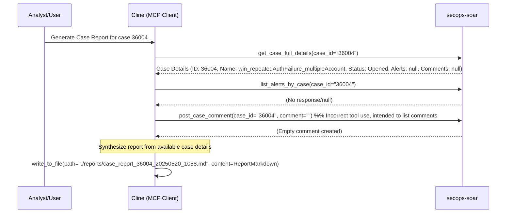

# Case Investigation Report: 36004

**Runbook Used:** Generate Case Investigation Report (.clinerules/run_books/case_report.md)
**Timestamp:** 2025-05-20 10:58 AM Australia/Melbourne
**Case ID(s):** 36004

## Workflow Diagram

## Executive Summary

This report summarizes the initial investigation steps for SOAR case 36004, titled "win_repeatedAuthFailure_multipleAccount". The case is currently "Opened", in "Triage" stage, with "PriorityMedium", and assigned to "@Tier1". The investigation was initiated based on the "Generate Case Investigation Report" runbook. Due to limitations in retrieving alert and comment details, this report is based on the primary case information.

## Case Details

*   **Case ID:** 36004
*   **Display Name:** win_repeatedAuthFailure_multipleAccount
*   **Create Time:** 1747697288548 (Approximately 2025-05-17 06:48:08 UTC)
*   **Update Time:** 1747701554804 (Approximately 2025-05-17 07:59:14 UTC)
*   **Status:** Opened
*   **Stage:** Triage
*   **Priority:** PriorityMedium
*   **Assignee:** @Tier1
*   **Alert Count:** 4 (Note: Specific alert details could not be retrieved during this runbook execution)
*   **Involved Suspicious Entity:** True
*   **Workflow Status:** Failed
*   **Source:** Server

## Timeline of Key Events

*   Initial case data retrieval was performed. Attempts to retrieve specific alerts and comments associated with the case were unsuccessful or returned no data.

## Involved Entities & Enrichment

*   Specific entities could not be extracted as alert details were unavailable. The case title "win_repeatedAuthFailure_multipleAccount" suggests involvement of Windows authentication systems and multiple user accounts.

## Analysis/Root Cause

*   A definitive analysis or root cause cannot be determined without further details from the associated alerts and events. The case title suggests an investigation into repeated authentication failures possibly indicative of a brute-force attack, password spraying, or misconfigured service.

## Actions Taken (by Cline)

1.  Initiated the "Generate Case Investigation Report" runbook for case 36004.
2.  Attempted to gather case data using `secops-soar.get_case_full_details`. Basic case information was retrieved.
3.  Attempted to list alerts using `secops-soar.list_alerts_by_case`, which yielded no specific alert data.
4.  Attempted to retrieve comments (incorrectly using `post_case_comment`), which did not yield existing comments.
5.  Synthesized this report based on the available case metadata.

## Recommendations/Lessons Learned

*   **Further Investigation Needed:** Due to the inability to retrieve alert details, a thorough investigation of the 4 associated alerts is critical. This will require direct access to the SOAR platform or alternative methods to retrieve alert and event data.
*   **Tooling Check:** Investigate why `list_alerts_by_case` did not return data despite `alertCount` being 4. Ensure the `secops-soar` MCP server tools are functioning as expected for listing alerts and comments.
*   Based on the case title, investigation should focus on authentication logs for Windows systems, identifying the source of failed logins, the accounts involved, and the timeframe of the activity.
